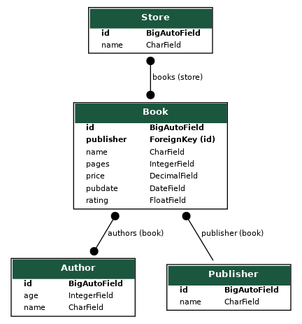

# DZ_Django2
### A new application has been created with the following models:
- Store
- Book
- Author
- Publisher

### Their connections:

#### To fill the database with data, I recommend using the command "createss", the maximum amount of data for one command is 20.
#### To create connections between tables, I recommend executing the command several times "connections".

## Update dated 11/16/2022.

#### A new "mail" application in which "Celery" is implemented
